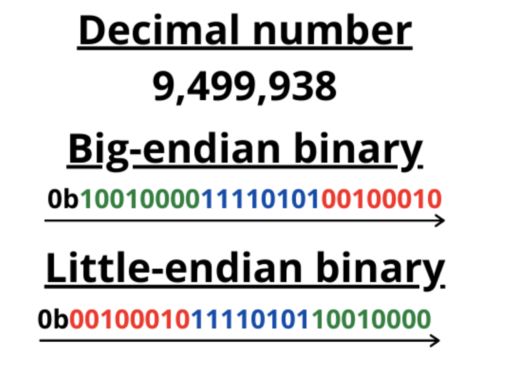
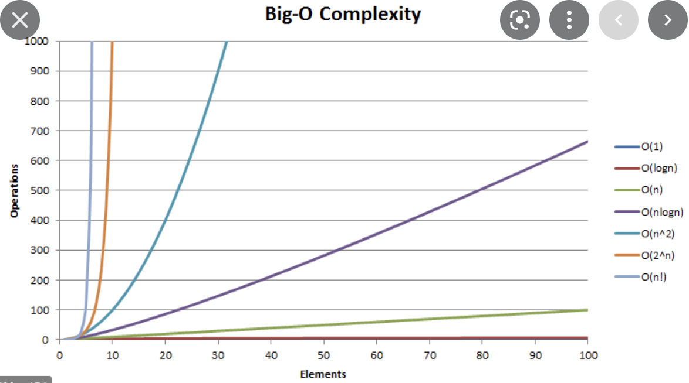
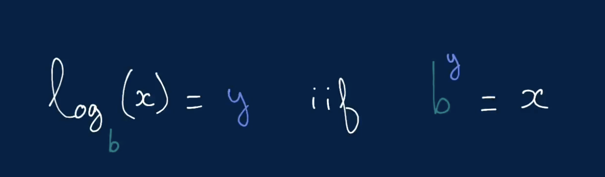
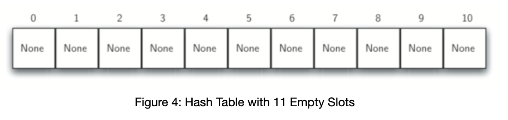

### Data structures

**Data structures** is a way to orginize and manage data. 
**Data structures** is a collections a values, the relationships among them and functions or operations that can be applied to the data. (Wikipedia definition)

# Complexity analysis
**Complexity analysis** the process of determining how efficient an algorithm is. Co,plexity analysis usually involves frinding both the **time complexity** and the **space complexity** of an algorithm.
Complexity analysis is effectively used to determine how "good" an algorithm is and whether it's better than another one.  

**Time complexity** is just a measure how fast code or algo gets executed. It's expressed using **Big O notation**. 
**Space complexity** is how much space algo or code uses up. It's expressed using **Big O notation**.

# Memory
**Memory** the program will store a variable in the available memory slot. 
If the programs needs more memory than in one slot, it will store variabled in back to back memory slots. 
Memory is made up of units called **bits**. Bits are zeros and ones. One memtory slot can store 8 bits, which is called a **byte**. 

**Endianness** meand that the bytes in computer memory are read in a certain order. Endianness is represented two ways **Big-endian (BE)** and **Little-endinan (LE)**. 
  - **BE** stores the **big-end** first. When reading multiple bytes (or the lowest memory address) is the biggest - so it makes the most sense to people who read from left to right. (Basically we store the most significant byte to the left)
  - **LE** stores the little end first. When reading multiple bytes the first byte (or the lowest memory address) is the littest - so it makes more sense for people who read from right to end. (Basically we store the most significant byte to the right)
  Example below: 
  

Integeres can be represented in 8, 16, 32, 64-bits and in such cases we are dealing with fixed-width integers. It means if we are working with 32-bits integer it will always be stored in 4 slots, for 64-bits it's 8 slots. That means the number of slots is always constant -> it will not increase as your integer will increase. 

Strings are stored in the memory similar way. The only thing they get converted into ASCII format, then the get converted into a bunch of bits and finally the sting will be stored as a list of numbers in memory. (Example "A" -> 65).

All memory slots are called **memory addresses**.  In memory slot can be stored the address of another memory slot. So, some memtory slots are simple pointers to another memory slots. 
Computer can access all the memory slots very quickly. 

# Big O notation



**Time complexity** more specifically is about the measure of algo runtime as the size of the input increases.
**O(1)** - constant time complexity, means as the size of the input increases, the runtime(speed) remains constant. 
**O(log(n))** - logarithmic time. Example of such time complexoty can be when we cut the array in half again and again. The number of oprations increases by one as we doubpe the input. Another example can be when we split binary tree in half. Ask questions: Am i eliminating half of the input at each step? if double the input, will i perform one extra step only? 
**O(n)** - linear time complexity. As the input size increases, the speed of the algo increases linearly.
**O(n log(n))** -   
**O(n^2)** - quadratic time complexity. As the input size increases, the speed of the algo increases quadratically. When we have two nested loops.
**O(2^n)** - 
**O(n!)** 

**Asymptotic analysis** mathematical term for analyzing the behavior of the function as the input of the funtion grows. It is used to describe big O notation. 

We don't care about constants when we define Big O Notation.
Example: O(2n^2 + n + 1) -> O(n^2), O(8) -> O(1), O(n^4 + n^2) -> O(n^4).
O(n + m) or O(m^2 + n) -> when we have two inputs.

**Big O notation** describes worst case scenario. 

**Logarithm** 


In computer science we always assume that we are dealing with log with base 2. (binary logarithm)


# Arrays 

There are two typed of arrays: *static* and *dynamic*.
*Static* array is fixed array that uses fixed number of memory slots, when we know the length. In Java or C++ when you declare an array, the length of the array had to be specified.  
*Dynamic* array is the array array that can change in size. in C++ and java dynamic arrays are vectors and array lists and in python and javascript startndard arrays are dynamic arrays. 

Here is the standard array's operations and their correspoding time complexity: 
    - Accessing a value at a given index: O(1) (time complexiry, space complexity)
    - Updating a value at a given index: O(1) (time complexiry, space complexity)
    - Array initialization: O(n) (time complexiry, space complexity)
    - Traversing through the array (for loop): O(n) (time complexiry),  O(1) (space complexity), because we are not storing anything, we just looping through each element. Another example can be when you map, filter, reduce an array. There will be the same time and space complexity as for traversal. 
    - Copy arrays: O(n) (space and time complexity) 
    - Inserting value in an array: pretty bad and constly operation, under the hood the entire array needs tp be copied, which is O(n) time and space complexity, then memory will free up the previous slots and find another back to back slots that will feet new array with inserted value. Dynamic arrays under the hood will allow to have faster insertions if we insert an elem at the end of the array. For dynamic array operation system will allocate twice as much memory as the array is asking for. During isertion for dynamic arrays, it will run fast up until the allocated space has been reached. Once the allocated space has been reached, only then array gets copied to allocate more memory for more insertions. For dynamic arrays insertion will take O(1) time complexity and O(n) in worst case. If we want to insert an elem in the beggining or in the middle of the array -> dynamic arrays won't help. It will still take O(n) time complexity.  
    - Popying(removimg) elem from the array: O(1) space and complexity time for the cases when we remove last elem from the array, for the cases whem we remove an elem at the beginning or in the middle of the array -> those are cases with O(n) time and space complexity. 
    - Whenever we perform an operations that affects half or quarter, etc of the array -> those are still O(n) operations. 


# Linked lists 

**Linked list** is conceptually very similar to an array. Where linked list is different in the way it's stored in the memory. Linked list will be stored anywhere in the memorym linked lists don't require back to back slots available like for arrays. Elements in linked list are connected using pointers. Linked list consists of nodes. Each ode consists of value and a pointer to the next node in the list. For linked list we will need two back to back memory slots for echa node, when one memory slot holds the value, another memory slot holds the pointer. Another node can be anywhere in memory. 
The start of the linked list is called *head*.  
The end of the linked list is called *tail*.

Operations with linked lists and complexity: 
    - Get the index of the linked list elem (we have to go from the first node till the elem we want to get index of) O(i) time complexity (i- the index of the elem) and O(1) memory complexity
    - Set the same as get 
    Note: in linked lists we don't really have the concpet of indices. We don't think about nodes at a given index. 
    - Initializing a linked list: O(n) space and time complexity 
    - Cope linked list: O(n) space and time complexity
    - Traversing a linked list: O(n) time complexity and O(1) space complexity 
    - Inserting at the begging of the linked list is always a constant time complexity: O(1) (because we just basically need to add another node and add a pointer)
    - Inserting at the end of the linked list depends on the implementation. If we don't know where the tail is, we will need to traverse the whole linked list until we reach the end and add new node there, which is O(n) time complexity. If we know where the end of the linked list, let's say we store it in some variabled, then we can just access it directly and change last pointer to point to the new last node, which is O(1) time complexity. Same for inserting new node in the middle of the linked list.
    - Searching for a value: O(n) 
Those are time complexities for singly linked list :point_up_2:
**Singly linked list** is when the each node in the list is connected with one pointer. 
Example: 
0 -> 1 -> 2 -> 3 -> 4 -> null
In singly linked list we call pointer the **next** pointer.  

**Doubly linked list** is when the each node has two pointers. 
Example: 
null <- 0 -> <- 1 -> <- 2 -> <- 3 -> <- 4 -> null
In doubly linked list we call pointers **next** and **prev** pointer. 
Hence, we are using three back to back memory slots (for the int and for two pointers). 
In doubly linked list you can go back and forth through the linked list.

Doubly linked list operations and complexities: 
- Access the head: O(1)
- Access the tail: O(1)
- Access a middle node: O(n)
- Inserting/Removing the head: O(1)
- Inserting/Removing the tail: O(1)
- Inserting/Removing the middle node: O(n) to access + O(1) to insert 
- Search for a value: O(n)

For linked lists we have to typically implement a class to work with it.


# Hash tables 

Hash tables are represented as dict in Python or objects in JavaScript. 
Hash table is a key/value store. It's a data structure where you're able to store pair of keys and values, where every key maps to value. 
Each position of the hash table, often called a **slot**, can hold an item and is named by integer value starting at 0. Initially, hash table contains no items, so each slot is empty. 




*The beauty of the hash table is that operations like insertions/deletion/searching are all operations that run in **constant** time in average.* But! in worst case it's O(n) in situations when we have collisions in the linked list. 

Hash tables use **dynamic array of linked lists**.  
Behind the scenes when you're inserting a key/value pair inside the hash table, you use what's called hash function to transform the key string into the index. The same approach is used for all other operations. For example: when you're searching, you're using hash function to transform the key into the index that will be used to grab the value in the underlying array. 

The mapping between an item and the slot where that item belongs in the hash table is called **hash function**.

**How hashing func works:**
first of all, we are converting string into ASCII reporesentation, then you sum up all the integers, you get a number. Then we do a modular (%) of the int we got from the string on the length of the underlying array and then use the result to get the value. <- that's what hasing in hash func does. Then, the value associated with the key is added to the linked list stored at that index in the dynamic array, and reference to the key is also stored with the value. 

**Collision** - when two or more items are store in the same slot in the hash table. 

Example of hash table: 
[
  0: (value1, key1) -> null
  1: (value2, key2) -> (value3, key3) -> (value4, key4)
  2: (value5, key5) -> null
  3: null
  4: (value6, key6) -> null
]

We can end up in the situation when keys after converting to ASCII and getting modulus from it will have the same value, in that case it will be called collision. And under the hood there will be a linked list that will point to the next elem and to the key itself. 
In modern world hashing functions are minimizing the number of collisions. So, we can truthfully assume that insertions/searching and deletion takes constant amount of time. 

**Perfect hash function** - a hash function that maps each item into a unique slot. One way to always have a perfect hash func is to increase the size of the hash table so that each possible value in the item range can be accomodated. This quaranatees that each item will have a unique slot. **Although it's practical for small number amount of items only**. 

**Folding method** is the method of constructing an efficient hasing function. It begins by deviding an item into equal-size pieces (the last piece may not be an equal size). These pieces are them added together to give the resulting hash value. For example, ro store the following phone number: 436-555-4601, we could divide it into the groups of 2(43, 65, 55, 46, 01). After the addition we get 210 and divide by 11 slots: 201 % 11 = 1, so the phone number wwill be stored at slot one. 

Another numberical technique for constructing a hash function is called **mid-square method**. We first square the item, and them extract some portion of the resulting digits. For example, if the item were 44, we would first compute 44 ^ 2 = 1936. By extracting the middle two digits, 93, nd performing the remainder step, we get 5(93%11).

**Collision resolution** - the process of placing of the second elem that collides with the first on the same slot into another slot. One if the way to do that is **open addressing** when we try to find the next open slot or address for the second conflicting elem. By systematically visiting each slot on at a time, we are performing n open addressing technique called **linear probing**. A disadvantage of linear probing is the tendency for **clustering**; items become clustered in the table. This means that if  many collisions occur at the same hash value, a number of surrounding slots will be filled by the linear probing resolution. 

The general name for the process looking of looking for another slot after a collision is called **rehashing**. 

Operations: 
- accessing elem in the hash table: O(1) - average time complexity, O(n) - amortized worst case, when we are dealing with collisions in hash table. 


**Resizing** in cases when the underlying array does not have enough space to fit so many key/value pairs to fit into your array (due to colissions for example), you can implement a hash table that resizes itself. 

Initializing of the hash table will take O(n) time and O(n) space complexity.

Hash table [implementation](hash_map_implementation.py)


# Stacks 

**Stack** - is a data structure that supports inserting and removing elements following **the last in first out** principle or **LIFO**.

Operations and their time complexity: 
- insertion: O(1) time ans sapce complexity 
- deletion: O(1) time and space complexity 
- searching for an elem: O(n) time and 0(1) space complexity
- peek: O(1) time complexity (peek - look at the next elem that can be removed, usually that elem is on the top of the stack)

Stack is a dynamic array under the hood or at elast it can be implemented using a **dynamic array** under the hood or **singly linked list**.
Stacks can be transformed into **MaxStack** or **MinStack** that can keep track of the largest/smallest elem in it. 


# Queues

**Queue** - is a data structure that supports inserting and removing elements following **the first in first out** principle or **FIFO**.

Operations and their time complexity: 
- insertion: O(1) time and space complexity 
- deletion: O(1) time and space complexity 
- searching for an elem: O(n) time and 0(1) space complexity 
- peek: O(1) time complexity (peek - look at the next elem that can be removed)

**Push** - the process of adding new elem on top of the stack.
**Pop** - the process of removing the elem from the top of the stack. 


Queue is typically implemented with a **doubly linked list**. Linked list helps to keep track of head and tail, hence allows to do insertion and deletion from the queue in constant time. 

**Enqueue** - the process of adding new elem into the queue. (We are adding new head)
**Dequeue** - the process of removing the elem from the queue. (We are removing the tail)

For the interest of saving time when solving an algo, basic arrays can be treated as queue though it's not technically correct, BUT you can still use the same principle **FIFO**.  

Queues can be converted into priority queues, which keeps track of an elem of high priority. 


# Strings 

**Strings** are data types, they can behave as data structures, because we can manipulate them. 
A string is stored in the memory as an array of integers, where each characted has been mapped to the integer, usually using ASCII. Every elem in the string will be stored using fixed amount of bytes (typically one byte of each character in the english alphabet). 

*All the operations that will be performed on the single character in the string will use constant time operations.*

Operations and complexity: 
- traversing through the string will require O(n) time complexity and O(1) space complexity
- copy a string: O(n) time and space complexity 
- get a character: O(1) time abd space complexity


In python and js strings are immutable after we created them, to change the string, we need to create a new string, copy an old string + include the new character. So, when we append a new character to the string we are copying a string every time and recreate it, so the running time will be O(n), not amortized constant time operation O(1). 
Example: 
foobar += "x"
means under the hood -> 
foobar = foobar + "x"

**Amortized analysis** averages the running times of operations in a sequence over that sequence.

That's why when we are dealing with changing a string it's recommended to split it into array of characters in code and there we can append values in amortized costant time.  And the we can reconcatenate that array of characters into a single string. 


# Graphs 

**Graphs** - is a collection of nodes that may or may not be connected one with one another. 
Elements in the graph are called **nodes**. Every node is a **vertex** in graph, nodes == **vertices**.  Nodes are connected via **connections**. Connections are called **edges**.
So graph is made of vertices and edges. 

Graph is **connected** if you can reach any other node in the graph from another node or rather if there is any other path between two nodes in the graph. 
**Diconnected/unconnected** graph is when not any other node in the graph is connected with another node. 
Some graphs are **directed**, meaning that the edges in those graphs have a direction, **undirected** graph would not have directions. 

Deirected graphs can be: 
**Strongly connected** - if there are bidirectional connections between the vertices of every pair of vertices. 
**Weakly connected** - if there are connections (but not necessarily bidirectionl ones) between the vertices of every pair of vertices.  

Graph can have **cycles** in it. If graph has a cycle, we call it **cyclic** graph, if not we call it **acyclic** graph. 
**Cycels** is when you have at least 3 or more vertices in the graph that are going into infinite loop, which creates a cycle. 
We typically represent a graph using adjacency list. 
**Adjacency list** - in simple words you can store a list of nodes in the graph and then every node stores the list of it's edges/adjacences. In code you typically is going to have a list of nodes where each node has a value and each node has a list of edges. Those edges are basically pointers under the hood. Finally in the arrya we will be storing vertices and for all the nodes we are going to store all the edges. 

For traversing graph we will be using two main traversing methods: **depth-first search/DFS** and **breadth-first search/BFS**. 

**Depth-frist traversal** - the idea is you're traversing the graph deeper first. So you start with the node and go over all the connections that node has deep and then wide. 

**Breadth-first traversal** - you're traversing wide first and then go deeper. 

Opertaions and complexity: 
- Storing a graph takes O(vertices + edges) space complexity 
- Traversing a graph: O(vertices + edges) time complexity 


# Trees 

**Tree** is a type of graph. When we talk about a tree we are referring to a graph structure that is rooted, meaning it has a root node or top node of the structure. Root node has child nodes. The structure is directed, because edges point downwards of the tree. Tree structure is acyclic. Each child node can have only one parent node. The tree is no allowed to be disconnected. 

The most common type of tree is **binary tree**. Binary tree is a normal tree, where each node has at at most two child nodes.  

**Ternary tree** when each node has at most three child nodes. 

**K-ary trees** are trees where each node has at most k nodes. 

**Binary search tree** or **BST** is a special type of a tree where every node satisfies a special **BST** property. 
**Min/max heaps** is a special type of the three where each node satisfies min or max heap property. 
**Tries** is a tree type data structure that typically stores characters in a string. 
**Balanced tree** is a tree that mantains O(log n) time complexity for the one path/sub-tree traversal. It's when we have more or less same amount of branches on the left and on the right from the root node. 

**Node** - is fundamental part of the tree. It can have a name called "key". A node cam also have an additional information that can be called *payload*.  
**Edge** - connects two nodes to show that there is a relasinship between them. Every node (except the root) is connected by exactly one incoming edge fron another node. Each node may have several outgoing edges. 
**Root** - the root of the tree is the only node in the tree that has no incoming edges. 
**Path** is ordered list of nodes that are connected by edges. 
**Subtree** is set of nodes and edges consisted of a parent and all the descendants of that parent. 
**Level** - the level of the node is the number of edges on the path from root node to n.
**Height** is equal to the maximum level of any node in the tree. 
Every path that starts from the top of the tree till the bottom of tree is called **branch**. 
Bottom nodes are called **leaf** nodes. 
Every tree has levels of the nodes. 
**Full binary tree** - it's a tree where leaf nodes have no children or a node has two children. If a node has children, it should be two children all the time, node can not have only one child to call the tree **full tree**. 
Example of  full tree:
```
    *
  /   \
 *     *
      / \
     *   *
    / \
   *   *
```

The tree is **complete** where every single level of the tree is filled up except the final level that may or may not be filled up. But if the final level has nodes, they should be filled up from left to right. So at the final level we can't have branch wihout a node. (The main thing is nodes filled up from left ro right). 
Example of complete tree:
```
        *
      /   \
     *     *
    / \   / \
   *   * *   *
  / \
 *   *
``` 

The tree is **full** if every node in the tree has either no children nodes or k-children nodes. 
**Perfect tree** is a tree where all the leaf nodes has the same depth (same amount of the number of levels).
Example of the perfect binary tree:
```
            *
       /        \
      *          *
    /  \       /   \ 
   *    *     *     *
  / \  / \   / \   / \
 *  * *   * *   *  *  *
```
Operations and complexity: 
- storing a tree: O(N) space complexity 
- traversing through the entire tree: O(n) time complexity 
- traversing a tree going one path (sub-tree) instead of two paths: O(log n) time complexity for balanced trees only 

There are three ways to **depth first traverse binary tree**: 
Prefix tells us when we will visit the node. 
- **Pre**order - **n**lr (first we visit node, then left subtree, then right subtree) 
- **In**order - l**n**r (first we visit left subtree, then node, then right subtree)
- **Post**order - lr**n** (first we visit left subtree, then right subtree, then node)

**Type of trees representation:**
- list of lists(Example: ['a', ['b', [], []], ['c', [], []]]) [Implementation](trees_list_of_lists.py)


# Important things to remember: 
- **x in s** operation for arrays is in average O(n) time complexity, while for dicts({}) it's average running time is constant O(1) and only for amortized worst case it's O(n) (e.q. when hash table or dict has collisions when things get slower).  Hence, in solutions to tasks if we need to check for example: 
``` 
if x in a:
  return x
```
if possible, it's better to have a as a dict and store values in it. That will reduce the running time of the algorithm. [Source](https://wiki.python.org/moin/TimeComplexity)

- **list.sort()** method takes **O(nlogn)** runnnig time complexity (important to rememer, it's not O(N)!). **Sort()** uses **Timsort** algo since version 2.3. [Source](https://www.educative.io/edpresso/what-is-the-python-list-sort) Same for sorted(). Remember, the majority of well optimized sorting algos have running time **O(nlogn)** (diff really will be in space complexity) and methods **sort()** and **sorted()** are no exeptions. 
- when the input for the task is **sorted** or in a **specific order** it's a good indicateor that the problem can be solved in liner time(O(n))
- when we have a string, let's say a = "" and we are adding another string to it, like a+='b' -> that is **O(n)** time complexity, BECAUSE under the hood we are copying an existing string, adding to it another string and create new string with added value. 
- if we know what will be the maximum input for creating a hash table, we can safely claim that creation of hash table will take constant space time, because we know the max number of elemens in the input. For example: O(26) if 26 is the max number of elems in the input -> will give O(1) because we don't care about constants(26 in our case). 
- sorted array usually points that the problem can be solved using binary search. When you see sorted array, think if binary search can be applied. 
- the only dict operation that is not O(1) is traversing(iteration) and copy


