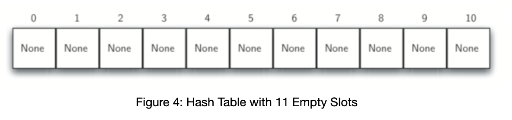

### Hash table
Hash tables are represented as dict in Python or objects in JavaScript. 
Hash table is a key/value store. It's a data structure where you're able to store pair of keys and values, where every key maps to value. 
Each position of the hash table, often called a **slot**, can hold an item and is named by integer value starting at 0. Initially, hash table contains no items, so each slot is empty. 

*The beauty of the hash table is that operations like insertions/deletion/searching are all operations that run in **constant** time in average.* But! in worst case it's O(n) in situations when we have collisions in the linked list. 

Hash tables use **dynamic array of linked lists**.  
Behind the scenes when you're inserting a key/value pair inside the hash table, you use what's called hash function to transform the key string into the index. The same approach is used for all other operations. For example: when you're searching, you're using hash function to transform the key into the index that will be used to grab the value in the underlying array. 

The mapping between an item and the slot where that item belongs in the hash table is called **hash function**.

**How hashing func works:**
first of all, we are converting string into ASCII reporesentation, then you sum up all the integers, you get a number. Then we do a modular (%) of the int we got from the string on the length of the underlying array and then use the result to get the value. <- that's what hasing in hash func does. Then, the value associated with the key is added to the linked list stored at that index in the dynamic array, and reference to the key is also stored with the value. 

**Collision** - when two or more items are store in the same slot in the hash table. 

Example of hash table: 
[
  0: (value1, key1) -> null
  1: (value2, key2) -> (value3, key3) -> (value4, key4)
  2: (value5, key5) -> null
  3: null
  4: (value6, key6) -> null
]

We can end up in the situation when keys after converting to ASCII and getting modulus from it will have the same value, in that case it will be called collision. And under the hood there will be a linked list that will point to the next elem and to the key itself. 
In modern world hashing functions are minimizing the number of collisions. So, we can truthfully assume that insertions/searching and deletion takes constant amount of time. 

**Perfect hash function** - a hash function that maps each item into a unique slot. One way to always have a perfect hash func is to increase the size of the hash table so that each possible value in the item range can be accomodated. This quaranatees that each item will have a unique slot. **Although it's practical for small number amount of items only**. 

**Folding method** is the method of constructing an efficient hasing function. It begins by deviding an item into equal-size pieces (the last piece may not be an equal size). These pieces are them added together to give the resulting hash value. For example, ro store the following phone number: 436-555-4601, we could divide it into the groups of 2(43, 65, 55, 46, 01). After the addition we get 210 and divide by 11 slots: 201 % 11 = 1, so the phone number wwill be stored at slot one. 

Another numberical technique for constructing a hash function is called **mid-square method**. We first square the item, and them extract some portion of the resulting digits. For example, if the item were 44, we would first compute 44 ^ 2 = 1936. By extracting the middle two digits, 93, nd performing the remainder step, we get 5(93%11).

**Collision resolution** - the process of placing of the second elem that collides with the first on the same slot into another slot. One if the way to do that is **open addressing** when we try to find the next open slot or address for the second conflicting elem. By systematically visiting each slot on at a time, we are performing n open addressing technique called **linear probing**. A disadvantage of linear probing is the tendency for **clustering**; items become clustered in the table. This means that if  many collisions occur at the same hash value, a number of surrounding slots will be filled by the linear probing resolution. 

The general name for the process looking of looking for another slot after a collision is called **rehashing**. 

Operations: 
- accessing elem in the hash table: O(1) - average time complexity, O(n) - amortized worst case, when we are dealing with collisions in hash table. 

**Resizing** in cases when the underlying array does not have enough space to fit so many key/value pairs to fit into your array (due to colissions for example), you can implement a hash table that resizes itself. 

Initializing of the hash table will take O(n) time and O(n) space complexity.

Hash table [implementation](hash_map_implementation.py)